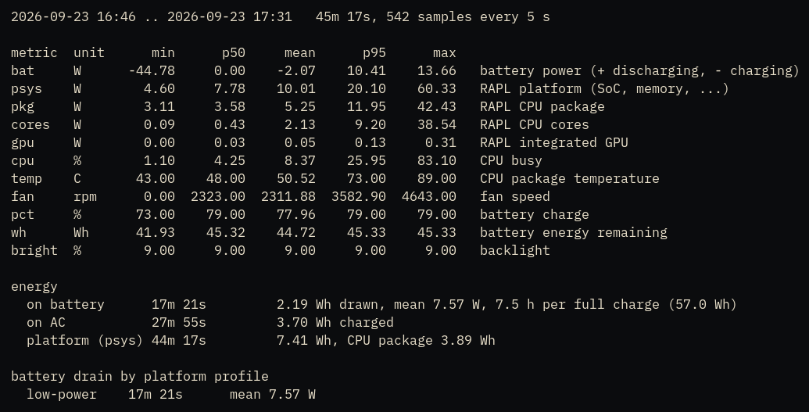
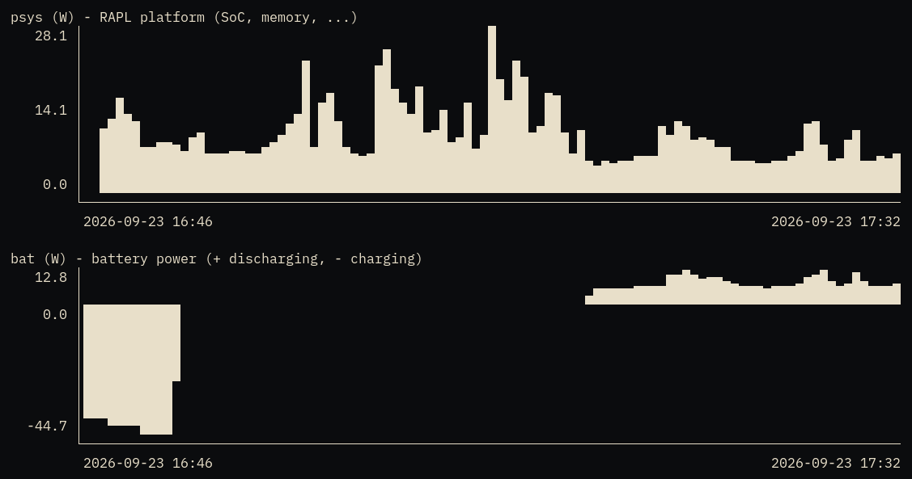
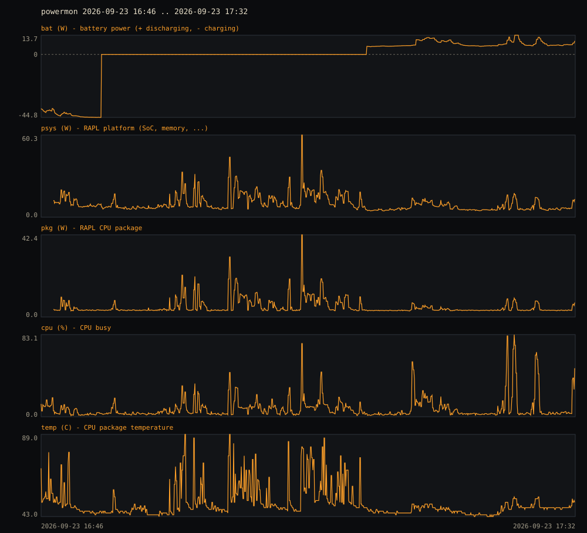

# powermon

A minimal power monitor for Linux laptops, written in Zig 0.16. One small static-ish binary records
power metrics into its own time series file and answers questions about them: statistics, terminal
charts, SVG, CSV.

## Screenshots

`powermon stats`: distribution per metric, energy, and battery drain per power profile



`powermon plot psys bat`: terminal charts; battery power hangs below zero while charging



`powermon svg`: the same data as a multi-panel SVG



`sudo powermon now` (the RAPL counters need root outside the service; the other metrics do not):

```
bat          6.85 W    battery power (+ discharging, - charging)
psys         6.06 W    RAPL platform (SoC, memory, ...)
pkg          3.47 W    RAPL CPU package
cores        0.15 W    RAPL CPU cores
gpu          0.12 W    RAPL integrated GPU
cpu          2.70 %    CPU busy
temp        48.00 C    CPU package temperature
fan          0.00 rpm  fan speed
pct         75.00 %    battery charge
wh          43.17 Wh   battery energy remaining
bright       9.00 %    backlight
status  discharging, profile low-power
```

## What it records

Every 5 seconds by default, one 48-byte record:

| metric | unit | source |
|---|---|---|
| `bat` | W | battery `power_now`; positive when discharging, negative when charging |
| `psys` | W | RAPL platform domain: SoC, memory and the rest of the platform |
| `pkg` | W | RAPL CPU package |
| `cores` | W | RAPL CPU cores |
| `gpu` | W | RAPL integrated GPU |
| `cpu` | % | CPU busy over the interval, from `/proc/stat` |
| `temp` | °C | CPU package temperature (hwmon `coretemp`) |
| `fan` | rpm | fan (hwmon `thinkpad`) |
| `pct` | % | battery charge |
| `wh` | Wh | battery energy remaining |
| `bright` | % | backlight |

plus the battery status, AC state, ACPI platform profile and a gap flag for the first sample after
start or resume. RAPL values are mean power over the interval, derived from the energy counters, so
integrated energy is exact whatever the sampling rate.

## No I/O on the sampling path

Every source is opened once at startup. A sample is then:

- one `read()` per RAPL counter on a `perf_event_open` descriptor (the `power` PMU), and
- a few `pread()`s on already-open sysfs and procfs attributes, which the kernel serves from memory.

No path lookups, no `open()`/`close()`, no allocation, no disk access. Samples are buffered in memory
and appended to the database in one `write()` every 60 samples (5 minutes), so the disk stays idle in
between. Queries send the recorder `SIGUSR1` first so they always include the latest samples.

The binary uses raw Linux syscalls throughout; libc is linked only for `localtime_r`.

## Database

`/var/lib/powermon/power.db`: a 64-byte header (magic `PWRMON\0\1`, record size, interval, creation
time) followed by fixed-size little-endian records in time order. Append-only; readers `mmap` the
file and binary-search on the timestamp. At 5 s it grows by about 0.8 MiB a day. The format is
trivial to read from other languages (see `src/db.zig`), and `powermon csv` exports everything.

## Usage

```
powermon now                      # one 1-second sample (RAPL values need root)
powermon stats                    # last 24 h: min/p50/mean/p95/max, energy, drain per profile
powermon stats --since 7d
powermon plot bat psys --since 2h # terminal charts
powermon svg --since 24h > day.svg
powermon csv --since all > power.csv
powermon info
powermon bar                      # "9.8W 5h12m" for polybar, i3status, waybar
```

Durations: `90s 30m 6h 2d 1w` or `all`; `--until` takes the same form as "time ago".

## Install

### Downloads

Each [release](https://github.com/0x64616e6e/powermon/releases) carries a Debian/Ubuntu package, a
static x86_64 Linux binary (musl, no dependencies) and `SHA256SUMS`:

```
curl -LO https://github.com/0x64616e6e/powermon/releases/download/v0.2.2/powermon_0.2.2-1_amd64.deb
curl -LO https://github.com/0x64616e6e/powermon/releases/download/v0.2.2/SHA256SUMS
sha256sum --ignore-missing -c SHA256SUMS
sudo apt install ./powermon_0.2.2-1_amd64.deb
```

The static binary runs anywhere for the query commands and `now`; to record in the background, use
the package or `contrib/install.sh` (which builds from source), since both also set up the service
and its system user.

### Debian / Ubuntu package

Build it yourself (needs zig 0.16 in `PATH`, plus `debhelper`):

```
dpkg-buildpackage -us -uc -b        # writes ../powermon_<version>_amd64.deb
sudo apt install ../powermon_0.2.2-1_amd64.deb
```

The package installs `/usr/bin/powermon`, the `powermon` system user (via sysusers) and
`powermon.service`, which it enables and starts. Removing or purging the package stops and removes
the service; the database in `/var/lib/powermon` is kept.

### From source (any systemd distribution)

```
contrib/install.sh      # zig build, /usr/local/bin/powermon, system user, service enabled and started
contrib/uninstall.sh    # removes them again, keeps the database
```

## The service

```
systemctl status powermon          # state
journalctl -u powermon             # log: RAPL availability, the user it switched to
sudo systemctl stop powermon       # pause recording (the buffer is written first)
sudo systemctl disable --now powermon
sudo systemctl edit powermon       # e.g. ExecStart=/usr/bin/powermon record --user powermon --interval 2
```

`powermon.service` (in `contrib/`, used by the package too) starts the recorder as root only to
open the RAPL perf counters: Debian sets `perf_event_paranoid=3`, and its kernel patch then admits
only `CAP_SYS_ADMIN` to `perf_event_open` (`CAP_PERFMON` is not enough). It then switches uid, gid
and groups to the `powermon` system user for good, which clears every capability, and refuses to run
if any survive. It has no network and sees a read-only file system except `/var/lib/powermon` and
`/run/powermon`.

After every sample the recorder also overwrites `/run/powermon/latest` (48 bytes on tmpfs, memory
only) with that sample; `powermon bar` reads it, so a status bar can refresh every few seconds without
forcing database writes.

Queries from any user ask the recorder to write its in-memory buffer by writing a byte to the FIFO
`/run/powermon/flush` (at most one flush per second), so results always include the last few seconds.
`systemctl reload powermon` does the same through `SIGUSR1`.

On distributions with `perf_event_paranoid` of 2 or less (Fedora, Arch, upstream default), the root
start is still used and still ends in the same unprivileged state.

## License

MIT. See [LICENSE](LICENSE).
